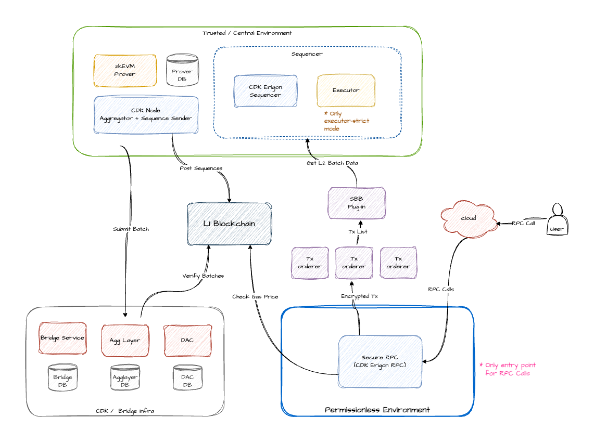

# Permissionless Node Infra Deploy

This repository contains a full set of Terraform modules for deploying the **Secure RPC Node (CDK Erigon)** in a permissionless environment, as shown below.

> ✅ It also supports optional local L1 node (Geth + Prysm) deployment for testing and integration purposes.



---

## ⚙️ Environment Configuration

Each deployment environment (e.g. `mainnet`, `sepolia`) should include its own `.env` file under `vars/<network>/`.

You can use `vars/.env.example` as a reference:

```bash
cp vars/.env.example vars/sepolia/.env
```

|Variable |	Description |
|---------|-------------|
|s3_bucket |	Name of the shared S3 bucket for Terraform state |
|aws_region |	AWS region (e.g. ap-northeast-2) |
|aws_profile_name |	AWS CLI profile name |
|launchL1 |	Whether to launch L1 node (Geth + Prysm) (true/false) |
|urlOfL1 |	L1 RPC URL to use if launchL1 = false |
|instances_type |	EC2 instance types and architectures per role |
|domain_name |	Optional. Your custom domain for secure RPC |

For full .env example, refer to vars/.env.example

<br/>


## 🚀 Quick Start

1. Select your target network (e.g. sepolia, mainnet)
2. Run deployment script:

```bash
# Set ENV and run deployment
ENV="sepolia" ./terraform.run.sh

# If you want to preview with terraform plan only instead of full deployment:
ENV="sepolia" ./terraform.var.sh
```

<br/>

## 📦 Module Structure

| 📁 Directory            | 🧩 Purpose                                     |
|------------------------|-----------------------------------------------|
| `01.init/`             | ☁️  S3 bucket, IAM roles, initial shared setup |
| `02.network/`          | 🌐 VPC, subnets, routing, availability zones   |
| `03.ec2/01.ec2_base/`  | 🧱 EC2 AMI, SSM IAM role                       |
| `03.ec2/02.ec2_lb/`    | 📶 Application Load Balancer                  |
| `03.ec2/`              | 🔐 CDK Erigon RPC and Secure RPC              |
| `config/`              | ⚙️  Docker Compose, config.yaml, scripts      |
| `vars/`                | 🗂️  Network-specific `.env` files              |


<br/>

## 🧪 Optional L1 Node (Geth + Prysm)
If launchL1="true" is set, the deployment will include an L1 full node using:

- geth.service
- prysm.service

Otherwise, set `launchL1="false"` and specify `urlOfL1` to use a remote L1 RPC (e.g. Infura).

<br/>

## 📁 State Management
Each Terraform module maintains its own remote state file on S3, defined via the .env file:

|Module	| S3 Key |
|-------|--------|
|02.network | (mainnet or sepolia)/network.tfstate |
|01.ec2_base | (mainnet or sepolia)/ec2_base.tfstate |
|02.ec2_lb | (mainnet or sepolia)/ec2_lb.tfstate |
|03.ec2 | (mainnet or sepolia)/ec2.tfstate |

<br/>

## 🔒 Secure RPC & Backup

This deployment includes a `secure-rpc-provider` running alongside the `cdk-erigon` node inside Docker.  
Erigon uses a **file-based storage** instead of an external DB, so the node's **entire data directory is directly backed up and restored** as compressed archives.

### 📂 Data Directory Handling

- The Erigon data is stored under `/home/ssm-user/data`
- Backups are taken by compressing this directory and uploading it to S3
- Restores fully replace the local data with the contents from the archive

### 🛠️ Provided Scripts

- [`backup-to-s3.sh`](./config/backup-to-s3.sh): Compress and upload the Erigon data directory to S3
- [`restore-from-s3.sh`](./config/restore-from-s3.sh): Download and extract data from S3, replacing the local state

> These scripts support environment injection and minimal configuration, making them suitable for daily cron jobs or manual execution.

<br/>

## 🧰 Requirements
- AWS account with CLI profile
- Terraform >= 1.3
- S3 bucket for remote state
- (Optional) Domain and ACM Certificate for HTTPS endpoint
